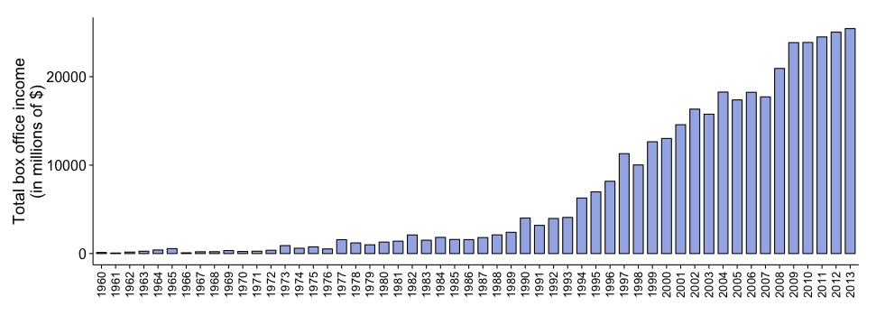
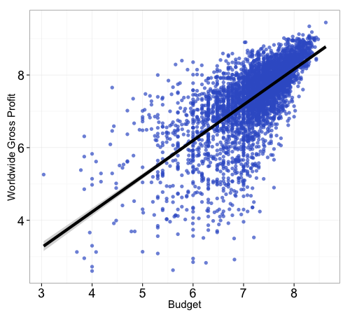
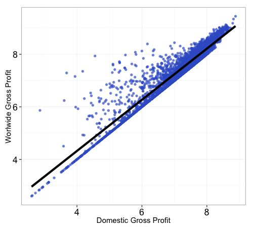
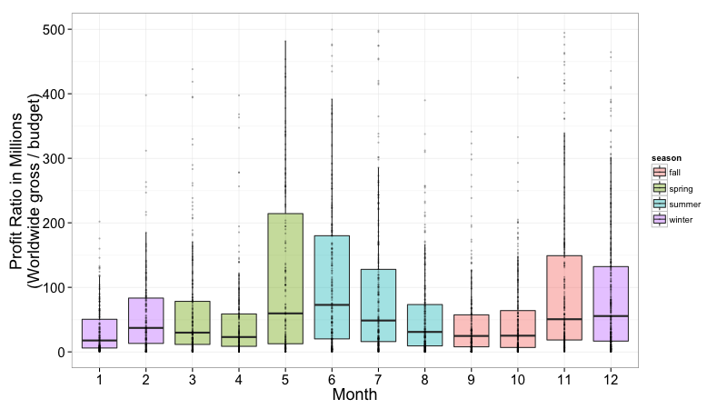
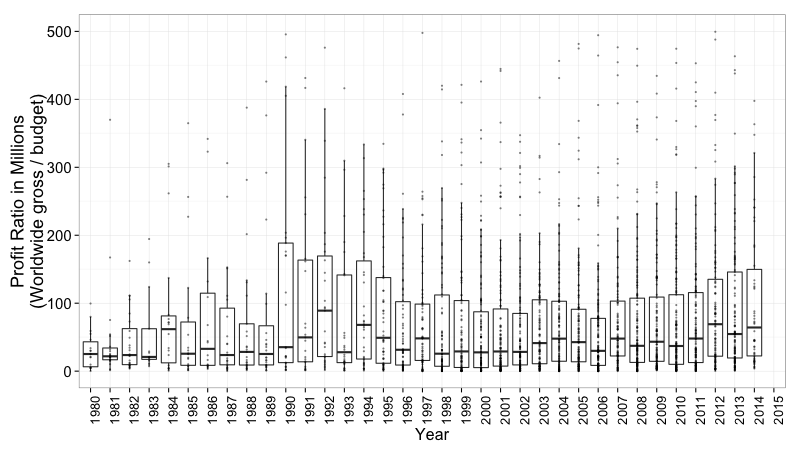
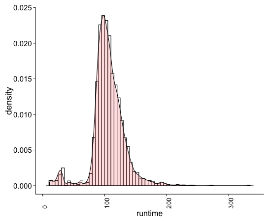
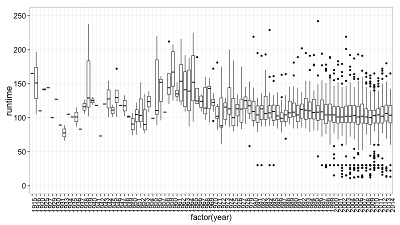
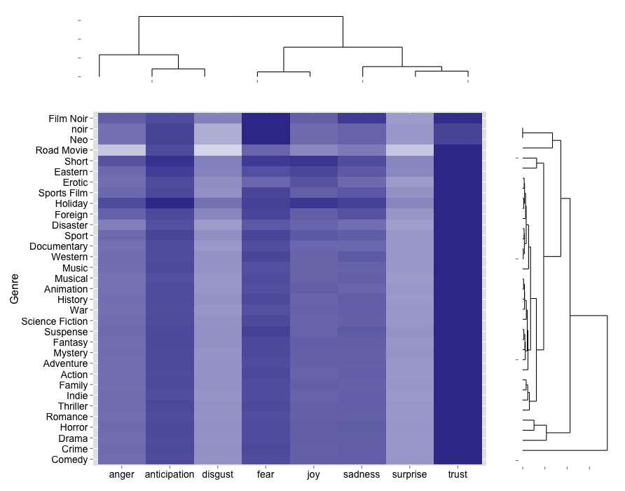

<br/>
<base target="_blank">
<center>
<font size="20">[MillionDollar$tory](https://rawgit.com/tlfvincent/INSIGHT_PROJECT/master/demo_presentation/MillionDollarStory_Presentation.html)</font>
</center>
<center>
## Behind the Scenes
</center>

<hr style="height:7px;border:none;color:#333;background-color:#333;" />

```{r results='asis', echo=FALSE}
suppressPackageStartupMessages(library(googleVis))
```

### Finding the solution behind blockbuster movies
Welcome! This page is a high-level description of MillionDollarStory, an app that uses screenplay information to predict whether a movie is most likely to a blockbuster or a flop. When a writer or production company executive receives a screenplay, s/he has little to no information aside from the screenplay scripts itself and the genre. MillionDollar$tory is unique in that it not account for any factors that are otherwisey unavailable at that time, such as prior popularity of actors and directors. Of course these factors can be extremely important, so not including them may limit the accuracy of this application. However, the goal was to find out the extent to which screenplay dictates the popularity of a movie, so explicitly excluding these factors from the analysis was a conscious choice.

Finally, we can also have some fun with the data collected for this analysis, an use it gather insights into the dynamics of the folm industry over the course of the last few decades:
- How have movie profits eveolved over time?
- Are moving getting longer?
- Who are the actors and directors that bring in the most revenue?
- Where do movies come from?

### The Data
Financial information on movie budget and box office revenue is not necessarily easy to come by, but some website have accumulated some information on this data, although it may not always be accurate and often contains many missing values. Below is a snipped of information extracted from the numbers.com., which contains budget and domestic/worlddwide revenue data for 5000+ movies.

<center>
```{r results='asis', echo=FALSE}
load(file='movie_profit.Rdata')
MovieProfit <- gvisTable(as.data.frame(movie.profit[1:200, ]), 
                      options=list(page='enable'))
print(MovieProfit, "chart")
```
</center>

### Total movie releases by country

```{r results='asis', echo=FALSE}
load(file='Movie_releases_by_country.Rdata')
G <- gvisGeoChart(country.hits, locationvar = "country", colorvar = "LogMovieCount", options = list(width = 900, 
        height = 450, 
        dataMode = "regions"))
print(G, "chart")
```

### The impact of genre on movie profitability
<center>

</center>


### Movie revenue across time
The first analysis we can run is to check the overall relationship between movie box office income and allocated movie budget. We can observe a very strong linear relationship between these two variables. 

<center>

</center>

We can also check the overall relationship movie box office revenue and allocated budget. We can observe a very strong linear relationship between these two variables. 

<div class="columns-2">
<center>


</center>
</div>


### Seasonal effects on movie box office revenue

The data extracted from the Rotten Tomatoes and IMDB API can also be used to investigate seasonal and yearly effects on box office profits. Not surprinsgly, we see that the summer months of May, June and July tend to report higher box office profits, presumably because of the timely release of "summer blockbusters". Similarly, the months of November and December also report elevated profit numbers, which would correspond to ThanksGiving and Christmas-related movie releases.

<center>
<strong>Movie profit by month of the year</strong>

</center>

When investigating movie box office profit as a function of year of release, we observe a relative increase over time, although the year of 1992 also stands out as particularly high. Further analysis showed that 1992 saw the release of many low budget movies that were widely heralded as blockbusters (see table below):
<center>
<strong>Annual movie profits between 1980 and 2014</strong>

</center>

<center>
```{r results='asis', echo=FALSE}
load(file='movies_released_1992.Rdata')
ReleasedMovie <- gvisTable(as.data.frame(movies.released.1992), 
                      options=list(page='enable'))
print(ReleasedMovie, "chart")
```
</center>

### Are movies getting longer?
Another feature that can be investigated is how the average runtime of movies has changed over time. Overall, the runtime of movies exhibits a bimodal distribution, with a large peak at around 110 minutes, and a smaller peak for small features at approximately 20 minutes.

<center>

</center>

We also observe that the runtime of released movies has fluctuated over time. Although it appears that movies were longer back in the days, this observation may be attributable to sample size effect, given that the number of data points available for this period of time is lower. Overall, there is a stable median runtime of 120 minutes for movies released from 1970 to present.

<center>

</center>

### The value of a director
We can also 'monetize' the value of movie directors according to the average profit their respective movies bring in.

<center>
```{r results='asis', echo=FALSE}
suppressPackageStartupMessages(library(googleVis))
load(file='top_directors.Rdata')
DirectorTable <- gvisTable(as.data.frame(top.rank), 
                      options=list(page='enable'))
print(DirectorTable, "chart")
```
</center>

### The value of actors
The value of actors can also be monetized according to the average profit their respective movies bring in. Here, we restricted the analysis to actors that had appeared in at least 5 movies. Furthermore, the order in which actors appeared in the casting list was not taken into account, which could be an area for improvement in future work.


<center>
```{r results='asis', echo=FALSE}
suppressPackageStartupMessages(library(googleVis))
load(file='top_actors.Rdata')
ActorTable <- gvisTable(as.data.frame(top.rank.actor), 
                      options=list(page='enable'))
print(ActorTable, "chart")
```
</center>

## Sentiment analysis of screenplays by genre
We can use the NRC emption lexicon to check the prevalence of human sentiments across different movie genres. "The lexicon has human annotations of emotion associations for more than 24,200 word senses (about 14,200 word types). The annotations include whether the target is positive or negative, and whether the target has associations with eight basic emotions (joy, sadness, anger, fear, surprise, anticipation, trust, disgust)." and can be accessed [here]](http://www.saifmohammad.com/WebPages/ResearchInterests.html).

<center>

</center>

### The colors of movie posters

