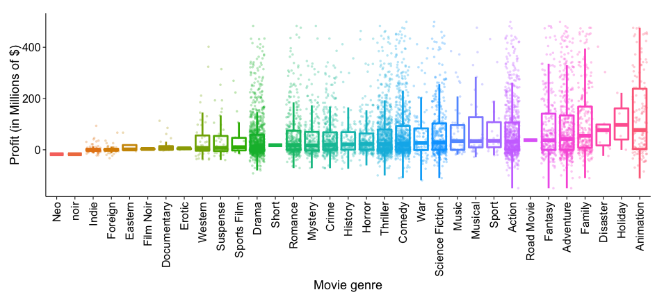

<center>
# MillionDollarStory
## Behind the Scenes
</center>

<hr style="height:7px;border:none;color:#333;background-color:#333;" />

```{r results='asis', echo=FALSE}
suppressPackageStartupMessages(library(googleVis))
```

### Finding the solution behind blockbuster movies
Welcome! This page is a high-level description of MillionDollarStory, an app that uses screenplay information to predict whether a movie is most likely to a blockbuster or a flop. When a writer or production company executive receives a screenplay, s/he has little to no information aside from the screenplay scripts itself and the genre. MillionDollar$tory is unique in that it not account for any factors that are otherwisey unavailable at that time, such as prior popularity of actors and directors. Of course these factors can be extremely important, so not including them may limit the accuracy of this application. However, the goal was to find out the extent to which screenplay dictates the popularity of a movie, so explicitly excluding these factors from the analysis was a conscious choice.

Finally, we can also have some fun with the data collected for this analysis, an use it gather insights into the dynamics of the folm industry over the course of the last few decades:
- How have movie profits eveolved over time?
- Are moving getting longer?
- Who are the actors and directors that bring in the most revenue?
- Where do movies come from?

### The Data
Financial information on movie budget and box office revenue is not necessarily easy to come by, but some website have accumulated some information on this data, although it may not always be accurate and often contains many missing values. Below is a snipped of information extracted from the numbers.com., which contains budget and domestic/worlddwide revenue data for 5000+ movies.

```{r results='asis', echo=FALSE}
load(file='movie_profit.Rdata')
MovieProfit <- gvisTable(as.data.frame(movie.profit[1:200, ]), 
                      options=list(page='enable'))
print(MovieProfit, "chart")
```

### Movie revenue across time
The first analysis we can run is to check the overall relationship movie box office revenue and allocated budget. We can observe a very strong linear relationship between these two variables. 

<center>

</center>

<center>

</center>

<center>

</center>

The data can also be used to investigate seasonal and yearly effects on box office revenues.

<center>

</center>

<center>

</center>

```{r results='asis', echo=FALSE}
load(file='movies_released_1992.Rdata')
ReleasedMovie <- gvisTable(as.data.frame(movies.released.1992), 
                      options=list(page='enable'))
print(ReleasedMovie, "chart")
```

### Are movies getting longer?

<center>

</center>

<center>

</center>

### The value of a director
```{r results='asis', echo=FALSE}
suppressPackageStartupMessages(library(googleVis))
load(file='top_directors.Rdata')
DirectorTable <- gvisTable(as.data.frame(top.rank), 
                      options=list(page='enable'))
print(DirectorTable, "chart")
```

### The value of actors
Actor must have acted in at least 5 movies
```{r results='asis', echo=FALSE}
suppressPackageStartupMessages(library(googleVis))
load(file='top_actors.Rdata')
ActorTable <- gvisTable(as.data.frame(top.rank.actor), 
                      options=list(page='enable'))
print(ActorTable, "chart")
```

### The impact of movie genre
<center>

</center>


<center>

</center>

### The colors of movie posters

### The Flop Equation

### Slide with R Code and Output

```{r results='asis'}
suppressPackageStartupMessages(library(googleVis))
G <- gvisGeoChart(Exports, locationvar = "Country", colorvar = "Profit", 
    options = list(width = 360, height = 280, dataMode = "regions"))
print(G, "chart")
```

