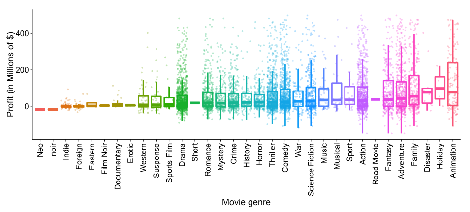

## About me

- Ph.D in BioStastics where I worked on predicting protein 3-D structure from sequence information.

- Currently a postdoctoral associate at Weill Cornell Medical College (New York), where I try and detect genetic mutations that separate smokers that get lung disease to those that don't.

## MillionDollar$tory

- Bullet 1
- Bullet 2
- Bullet 3

## Data Analysis

```{r}
summary(cars)
```
## Movie analytics

***
This text will appear to the right

## Predicting Flops

```{r, echo=FALSE}
plot(cars)
```

rmarkdown::render("MillionDollarStory_Presentation.Rmd")