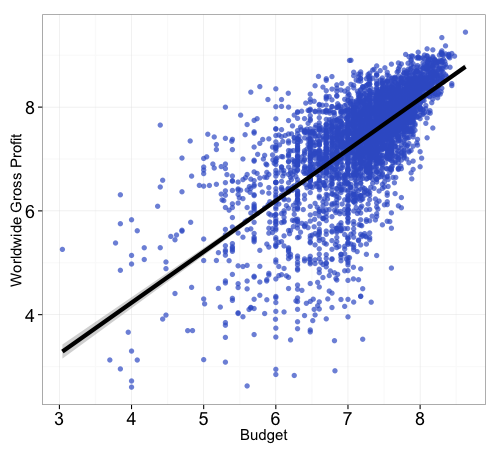
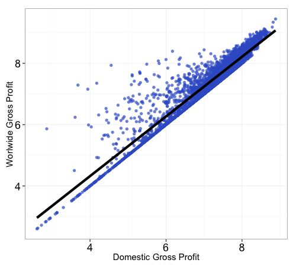
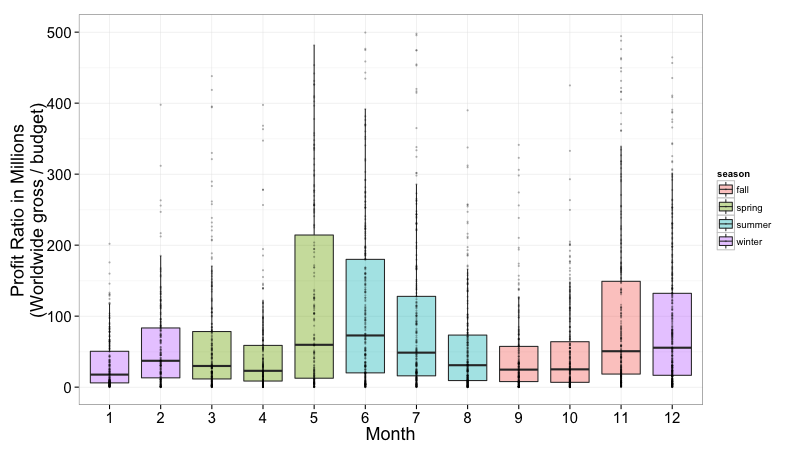
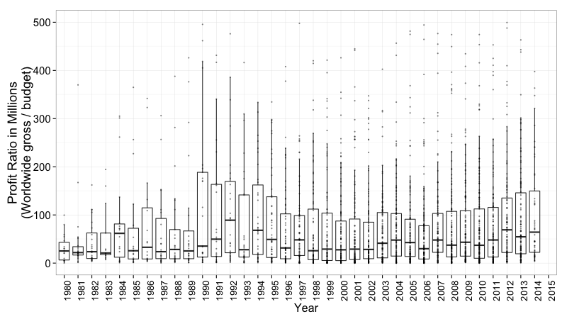
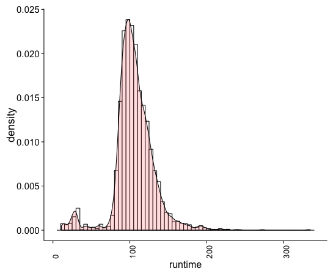

<center>
# MillionDollarStory
## Behind the Scenes
</center>

<hr style="height:7px;border:none;color:#333;background-color:#333;" />


### The Data

Probably accurate data on movie budget and revenue

Release Date  | Movie | Production Budget | Domestic Gross | Worldwide Gross
------------- | ------------- | ------------- | ------------- | -------------
12/18/2009 | Avatar | $425,000,000 | $760,507,625 | $2,783,918,982
5/24/2007 | Pirates of the Caribbean: At World's End | $300,000,000 | $309,420,425 | $960,996,492
7/20/2012 | The Dark Knight Rises | $275,000,000 | $448,139,099 | $1,079,343,943
7/2/2013 | The Lone Ranger | $275,000,000 | $89,289,910 | $259,989,910
3/9/2012 | John Carter | $275,000,000 | $73,058,679 | $282,778,100
11/24/2010 | Tangled | $260,000,000 | $200,821,936 | $586,581,936
5/4/2007 | Spider-Man 3 | $258,000,000 | $336,530,303 | $890,875,303
12/14/2012 | The Hobbit: An Unexpected Journey | $250,000,000 | $303,003,568 | $1,014,703,568
7/15/2009 | Harry Potter and the Half-Blood Prince | $250,000,000 | $301,959,197 | $934,416,487
12/13/2013 | The Hobbit: The Desolation of Smaug | $250,000,000 | $258,366,855 | $950,466,855


### Movie revenue across time

Budget and the worldwide revenue of movies
```
df <- data.frame(budget=log(budget[valid.index], 10), worldwide=log(worldwide[valid.index], 10))
ggplot(df, aes(x=budget, y=worldwide)) +
  geom_point(size=2.5, alpha=0.7, color='royalblue3') +
  geom_smooth(method='lm', size=2, color='black') +
  theme_bw() +
  ylab('Worldwide Gross Profit') + xlab('Budget') +
  theme(axis.text.x=element_text(size=18), 
        axis.title.x=element_text(size=15),
        axis.text.y=element_text(size=18),
        axis.title.y=element_text(size=15))
```
<center>

</center>

<center>

</center>

<center>

</center>

<center>

</center>

|year |title                          |budget     |domestic    |worldwide   |
|:----|:------------------------------|:----------|:-----------|:-----------|
|1992 |Batman Returns                 |80,000,000 |162,833,635 |266,824,291 |
|1992 |Death Becomes Her              |55,000,000 |58,422,650  |149,022,650 |
|1992 |Alien 3                        |55,000,000 |54,927,174  |158,500,000 |
|1992 |Patriot Games                  |45,000,000 |83,287,363  |178,100,000 |
|1992 |Boomerang                      |42,000,000 |70,052,444  |131,052,444 |
|1992 |Hero                           |42,000,000 |19,487,173  |66,787,173  |
|1992 |A League of Their Own          |40,000,000 |107,533,925 |132,440,066 |
|1992 |Bram Stoker's Dracula          |40,000,000 |82,522,790  |215,862,692 |
|1992 |The Last of the Mohicans       |40,000,000 |75,505,856  |75,505,856  |
|1992 |Medicine Man                   |40,000,000 |44,948,240  |44,948,240  |
|1992 |Memoirs of an Invisible Man    |40,000,000 |14,358,033  |14,358,033  |
|1992 |Lethal Weapon 3                |35,000,000 |144,731,527 |319,700,000 |
|1992 |Malcolm X                      |35,000,000 |48,169,910  |48,169,910  |
|1992 |Radio Flyer                    |35,000,000 |4,651,977   |4,651,977   |
|1992 |A Few Good Men                 |33,000,000 |141,340,178 |236,500,000 |
|1992 |Aladdin                        |28,000,000 |217,350,219 |504,050,219 |
|1992 |The Bodyguard                  |25,000,000 |121,945,720 |410,900,000 |
|1992 |Home Alone 2: Lost in New York |20,000,000 |173,585,516 |358,994,850 |
|1992 |Wayne's World                  |20,000,000 |121,697,323 |183,097,323 |
|1992 |Unforgiven                     |14,400,000 |101,157,447 |159,157,447 |

<center>

</center>

### Slide with Bullets

- Bullet 1
- Bullet 2
- Bullet 3

### Slide with R Code and Output

```{r results='asis'}
suppressPackageStartupMessages(library(googleVis))
G <- gvisGeoChart(Exports, locationvar = "Country", colorvar = "Profit", 
    options = list(width = 360, height = 280, dataMode = "regions"))
print(G, "chart")
```


rmarkdown::render("MillionDollarStory_BehindTheScenes.Rmd")